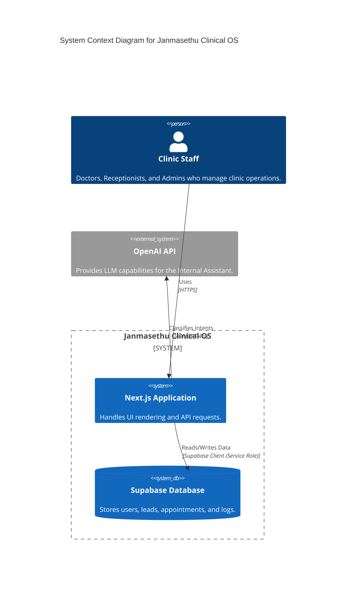
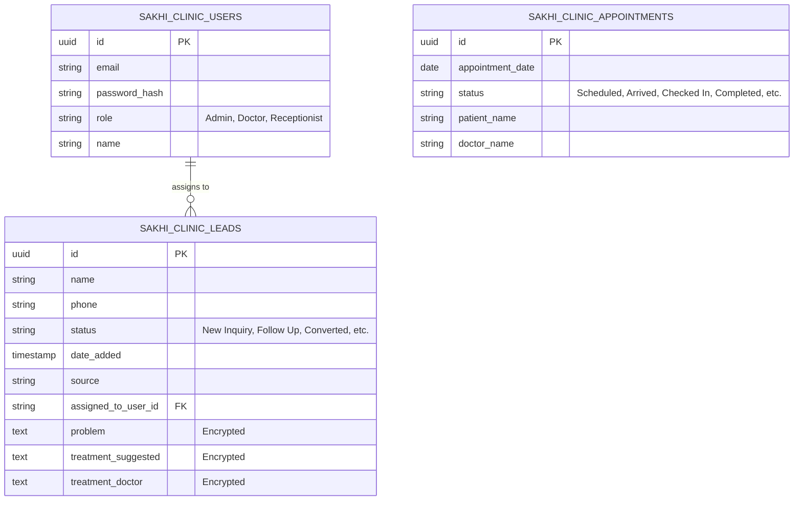
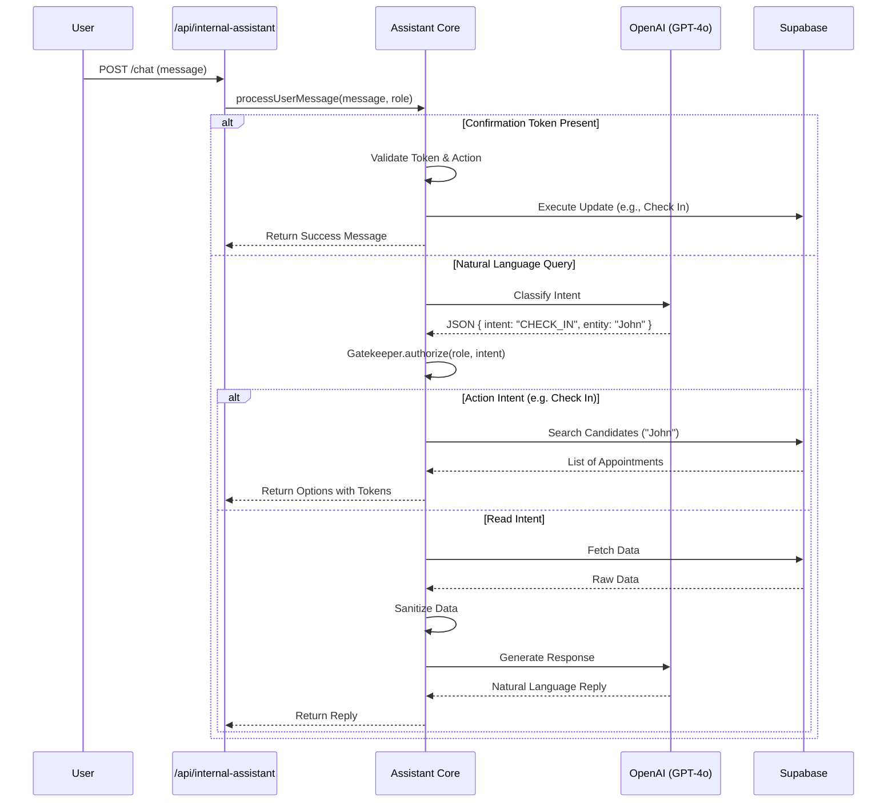

# System Design & Architecture: Janmasethu Clinical OS

## 1. High-Level Architecture

The Janmasethu Clinical OS is a **Next.js 14** application serving as both the frontend and backend API. It leverages to **Supabase** (PostgreSQL) as its primary data store and **OpenAI** for intelligent features (Internal Assistant).

### System Context Diagram (C4 Level 1)

---

## 2. Technology Stack

| Category | Technology | Description |
| :--- | :--- | :--- |
| **Framework** | Next.js 14 (App Router) | React framework for frontend and backend API. |
| **Language** | TypeScript | Type-safe development. |
| **Database** | Supabase (PostgreSQL) | Managed database service. |
| **Authentication** | Custom JWT + Supabase | Custom `jsonwebtoken` implementation with `sakhi_clinic_users` table. |
| **Encryption** | Node.js Crypto | AES-256-CBC encryption for sensitive patient data. |
| **AI/LLM** | OpenAI (GPT-4o) | Intent classification and response generation. |
| **Hosting** | Vercel (Implied) | Optimized for Next.js. |

---

## 3. Database Schema (Inferred)

The application interacts with a Supabase PostgreSQL database. Key tables and relationships are inferred from the codebase.

### Entity Relationship Diagram (ERD)

---

## 4. Key Modules

### 4.1. Authentication (`lib/auth.ts`)
- **Mechanism**: Custom JWT-based authentication.
- **Verification**: Middleware/Helper `validateSession` checks the `Authorization: Bearer <token>` header.
- **Passwords**: Hashed using `password-hash` (with a fallback to plain text check for legacy/dev).
- **Session**: Stateless; token contains user ID, email, and role.

### 4.2. Internal Assistant (`lib/internal-assistant`)
The "brain" of the application, allowing staff to query data and perform actions via chat.

**Architecture Pipeline:**
1.  **Process Request**: `processUserMessage` receives user input.
2.  **Token Check**: Checks for `confirmationToken` (for executing actions like "Check In").
3.  **Intent Classification**: Uses `OpenAI` (GPT-4o) to map natural language to an `Intent` (e.g., `ACTION_CHECK_IN`, `VIEW_LEADS`).
4.  **Gatekeeper (RBAC)**: Checks if the user's `role` is authorized for the `Intent`.
5.  **Search/Fetch**:
    *   **Read**: Fetches data via `DataFetcher`.
    *   **Action**: Searches for candidates (e.g., "Check in John") and returns options with **Confirmation Tokens**.
6.  **Sanitization**: Scrubs sensitive data using `Sanitizer`.
7.  **Response**: Generates a natural language response via `Responder` (LLM-augmented).

### Internal Assistant Sequence Diagram

### 4.3. Leads Management (`app/api/leads`)
- **CRUD**: specific endpoints for creating and listing leads.
- **Normalization**: `normalizeLead` handles CSV import edge cases (e.g., "Lead Name" vs "name", "Status" vs "Source" swaps).
- **Security**: Sensitive medical fields (`problem`, `treatment_suggested`) are **encrypted** at rest using Node.js `crypto`.

### 4.4. Control Tower (`app/api/control-tower`)
- **Purpose**: Operational dashboard for clinic status.
- **Metrics**: Aggregates appointment statuses (`Scheduled`, `Arrived`, `Checked In`, `Completed`) from `sakhi_clinic_appointments` for the current day.
- **Real-time**: Leverages `force-dynamic` to ensure fresh data.

---

## 5. Security Considerations

- **Row Level Security (RLS)**: The backend uses `getSupabaseAdmin()` (Service Role), effectively bypassing RLS. Security is enforced via application-level logic (`Gatekeeper` and `validateSession`).
- **Data Encryption**: Sensitive fields in `Leads` are encrypted before storage.
- **Context Isolation**: The Internal Assistant explicitly checks permissions before executing actions or fetching data.
