# Database Schema Documentation

## 1. Overview
The database is hosted on **Supabase** (PostgreSQL). The schema consists of four primary tables managing users, leads, patients, and appointments.

## 2. Entity Relationship Diagram (ERD)

```mermaid
erDiagram
    sakhi_clinic_leads {
        uuid id PK
        timestamp created_at
        text name
        text phone
        text status
        date date_added
        text age
        text gender
        text source
        text inquiry
        text problem "Encrypted (AES-256-GCM)"
        text treatment_doctor "Encrypted (AES-256-GCM)"
        text treatment_suggested "Encrypted (AES-256-GCM)"
        uuid assigned_to_user_id FK
        text guardian_name
        text guardian_age
        text location
        text alternate_phone
        boolean referral_required
        text notes
    }

    sakhi_clinic_patients {
        uuid id PK
        text uhid "Unique Health ID"
        uuid lead_id FK
        text name
        text mobile
        text email
        text gender
        date dob
        integer age
        text marital_status
        text blood_group
        text aadhar
        text house
        text street
        text area
        text city
        text district
        text state
        text postal_code
        text emergency_contact_name
        text emergency_contact_phone
        text emergency_contact_relation
        uuid assigned_doctor_id FK
        text referral_doctor
        text hospital_address
        date registration_date
        text status
        text relation
        timestamp created_at
    }

    sakhi_clinic_appointments {
        uuid id PK
        uuid patient_id FK
        uuid lead_id FK
        uuid doctor_id FK
        date appointment_date
        time start_time
        time end_time
        text type
        text status
        text visit_reason
        text resource_id
        text source
        text referral_doctor
        text referral_doctor_phone
        text referral_notes
        text patient_name_snapshot "Snapshot"
        text sex_snapshot "Snapshot"
        text doctor_name_snapshot "Snapshot"
        text patient_phone_snapshot "Snapshot"
        text patient_dob_snapshot "Snapshot"
        text patient_email_snapshot "Snapshot"
        text patient_address_snapshot "Snapshot"
        text patient_postal_code_snapshot "Snapshot"
        text patient_marital_status_snapshot "Snapshot"
        text patient_age_snapshot "Snapshot"
    }

    sakhi_clinic_users {
        uuid id PK
        text name
        text email
        text role
        text password_hash "Hashed"
    }

    sakhi_clinic_leads ||--o| sakhi_clinic_users : "assigned_to"
    sakhi_clinic_patients ||--o| sakhi_clinic_leads : "converted_from"
    sakhi_clinic_patients ||--o| sakhi_clinic_users : "assigned_doctor"
    sakhi_clinic_appointments }|--|| sakhi_clinic_patients : "for_patient"
    sakhi_clinic_appointments }|--o| sakhi_clinic_leads : "for_lead"
    sakhi_clinic_appointments }|--o| sakhi_clinic_users : "with_doctor"
```

## 3. Table Details

### 3.1 `sakhi_clinic_leads`
Stores potential patient inquiries.
-   **Security**: Fields `problem`, `treatment_doctor`, and `treatment_suggested` are encrypted at rest using AES-256-GCM.
-   **Key Columns**: `status` tracks the lead lifecycle (New Inquiry -> Converted/Lost).

### 3.2 `sakhi_clinic_patients`
Stores registered patient profiles.
-   **UHID**: Unique Health ID generated for each patient.
-   **Relationship**: Can be linked to a source `lead_id`.

### 3.3 `sakhi_clinic_appointments`
Manages scheduling.
-   **Snapshots**: Contains several `_snapshot` columns (e.g., `patient_name_snapshot`) to preserve historical data even if the referenced patient/doctor record changes.
-   **Status**: Tracks appointment state (Scheduled, Completed, No-Show, etc.).

### 3.4 `sakhi_clinic_users`
Stores system users (Doctors, Front Desk, Admins).
-   **Auth**: Stores `password_hash` for custom authentication.
-   **Roles**: `role` column defines permissions (e.g., `admin`, `doctor`, `front_desk`, `cro`).
